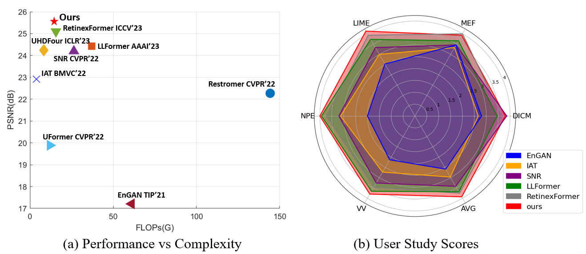
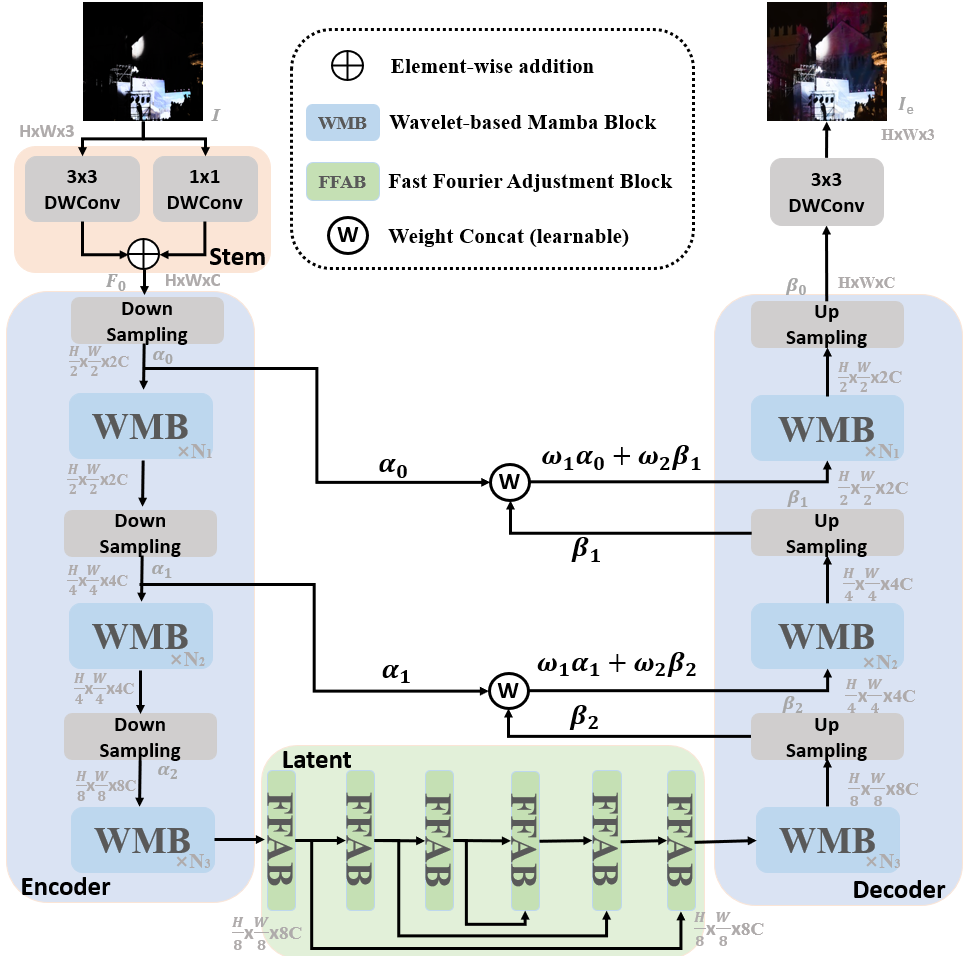
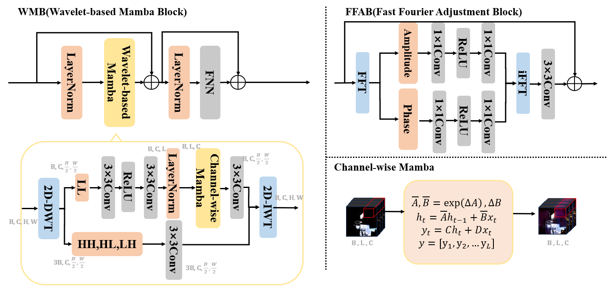
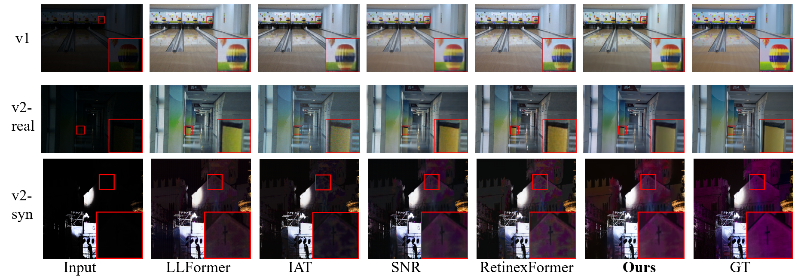
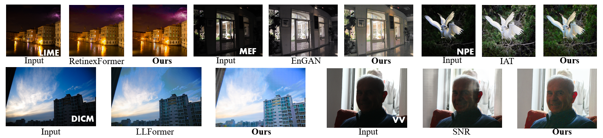

## Wavelet-based Mamba with Fourier Adjustment for Low-light Image Enhancement(WalMaFa)


Junhao Tan, Songwen Pei

>**Abstract:** Frequency information (e.g., Discrete Wavelet Transform and Fast Fourier Transform) has been widely applied to solve the issue of Low-Light Image Enhancement (LLIE). However, existing frequency-based models primarily operate in the simple wavelet or Fourier space of images, which lacks utilization of valid global and local information in each space. We found that wavelet frequency information is more sensitive to global brightness due to its low-frequency component while Fourier frequency information is more sensitive to local details due to its phase component. In order to achieve superior preliminary brightness enhancement by optimally integrating spatial channel information with low-frequency components in the wavelet transform, we introduce channel-wise Mamba, which compensates for the long-range dependencies of CNNs and has lower complexity compared to Diffusion and Transformer models. So in this work, we propose a novel Wavelet-based Mamba with Fourier Adjustment model called **WalMaFa**, consisting of a Wavelet-based Mamba Block (WMB) and a Fast Fourier Adjustment Block (FFAB). We employ an Encoder-Latent-Decoder structure to accomplish the end-to-end transformation. Specifically, WMB is adopted in the Encoder and Decoder to enhance global brightness while FFAB is adopted in the Latent to fine-tune local texture details and alleviate ambiguity. Extensive experiments demonstrate that our proposed WalMaFa achieves state-of-the-art performance with fewer computational resources and faster speed.

#### News
- **Jun 8, 2024:** Pre-trained models are released!
- **Jun 8, 2024:** Codes is released!
- **Jun 8, 2024:** Homepage is released!




## Network Architecture


The overview of the WalMaFa architecture. Our model consists of an Encoder-Latent-Decoder structure that uses wavelet-based WMB to adjust global brightness during the Encoder and Decoder, and Fourier-based FFAB to adjust local details during the Latent.

## Module Design

## Qualitative results
### Results on LOL datasets



### Results on non-reference datasets



## Get Started
### Dependencies and Installation
1. Create Conda Environment 
```
conda create -n WalMaFa python=3.8
conda activate WalMaFa
conda install pytorch==1.13.1 torchvision==0.14.1 torchaudio==0.13.1 pytorch-cuda=11.7 -c pytorch -c nvidia
pip install matplotlib scikit-image opencv-python yacs joblib natsort h5py tqdm einops tensorboard pyyaml mamba_ssm
```
2. Clone Repo
```
git clone https://github.com/mcpaulgeorge/WalMaFa.git
```


### Pretrained Model
We provide the pre-trained models:
- WalMaFa trained on LOL [[Google drive](https://drive.google.com/drive/folders/1J7NvvPsCtT0j8Rd9ombJ6sVIC6v0Xweb?usp=share_link) | [Baidu drive](https://pan.baidu.com/s/1j5KwGHWxMsaPwHP2u5Vj7A?pwd=5zyt)]


### Test
You can directly test the pre-trained model as follows

1. Modify the paths to dataset and pre-trained mode. 
```python
# Tesing parameter 
input_dir # the path of data
result_dir # the save path of results 
weights # the weight path of the pre-trained model
```

2. Test the models for LOL dataset

You need to specify the data path ```input_dir```, ```result_dir```, and model path ```weight_path```. Then run
```bash
python test.py --input_dir your_data_path --result_dir your_save_path --weights weight_path

```

### Train

1. To download datasets training and testing data

2.  To train WalMaFa, run
```bash
python train.py -yml_path your_config_path
```


